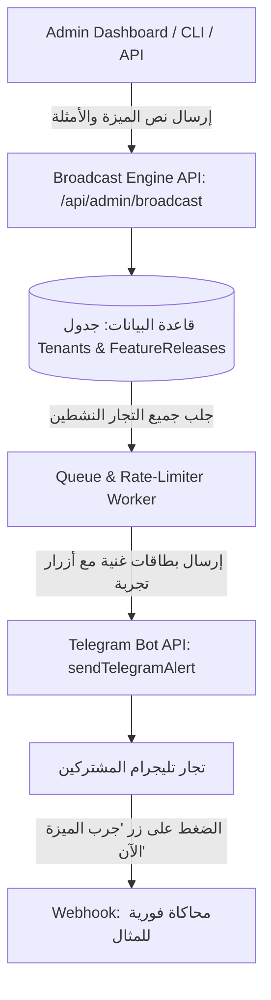

# تصميم وبناء نظام إرسال التحديثات والأمثلة التفاعلية (Feature Broadcast & Release Notes Engine)

## 1. نظرة عامة على النظام (Overview)
الهدف هو تمكين الإدارة من إرسال بطاقات تحديث غنية (Interactive Feature Release Cards) لجميع التجار والمشتركين النشطين عبر بوت تليجرام فور إطلاق أي ميزة أو Function جديدة، مع توفير أمثلة حية، تعليمات صوتية/نصية، وأزرار تجربة فورية بنقرة واحدة.

---

## 2. الهيكل الفني ومكونات النظام (Architecture)

---

## 3. مواصفات رسالة التحديث (Release Note Card Anatomy)
تحتوي كل رسالة تحديث على 4 عناصر رئيسية:
1. **عنوان الميزة (Feature Headline):** اسم الميزة مع إيموجي جذاب (مثال: `🚀 ميزة جديدة: محرك التذكيرات الذكية ⏰`).
2. **شرح القيمة للتاجر (Value Proposition):** جملة بالعامية المصرية توضح الفائدة المباشرة للتاجر.
3. **أمثلة الاستخدام (Live Examples):**
   - *مثال كتابي/صوتي 1:* `"فكرني بكرة الساعة 5 اكلم المهندس محمود"`
   - *مثال كتابي/صوتي 2:* `"نبهني بعد ساعتين بفلوس المورد"`
   - *مثال كتابي/صوتي 3:* `"ايه التذكيرات اللي عندي يا كاسبر؟"`
4. **أزرار تفاعلية بنقرة واحدة (Interactive Quick-Try Buttons):**
   - زر `[🧪 جرب المثال 1]`: يرسل الأمر تلقائياً للبوت لتجربة الرد فوراً.
   - زر `[📖 شرح التفاصيل]`: يفتح دليلاً مصغراً داخل المحادثة.

---

## 4. تدابير الأمان ومنع الحظر (Rate-Limiting & Safety)
- **مراعاة حدود تليجرام:** إرسال الرسائل بدفعات (Batches) بحد أقصى 25-30 رسالة/ثانية لتجنب `HTTP 429 Too Many Requests`.
- **تسجيل حالة الاستلام (Delivery Tracking):** تسجيل من استلم الرسالة ومن قام بحظر البوت لمنع تكرار الإرسال.
- **التجربة قبل النشر العام (Admin Preview First):** إرسال عينة تجريبية لشات الأدمن أولاً للتأكد من تنسيق الرسالة والأزرار قبل الإرسال للجميع.

---

## 5. خطة التنفيذ (Implementation Roadmap)
1. **المرحلة 1:** إنشاء نموذج `FeatureRelease` في Prisma لتخزين سجل التحديثات والتسليم.
2. **المرحلة 2:** بناء نقطة إرسال `/api/admin/broadcast` مع دعم Rate-Limiting وتجزئة الدفعات.
3. **المرحلة 3:** إضافة معالج Webhook لأزرار `try_feat_<id>_<exampleId>` لتنفيذ المثال فور ضغط التاجر.
4. **المرحلة 4:** إضافة واجهة إرسال سريعة في لوحة الإدارة (Dashboard) + سكريبت CLI.
