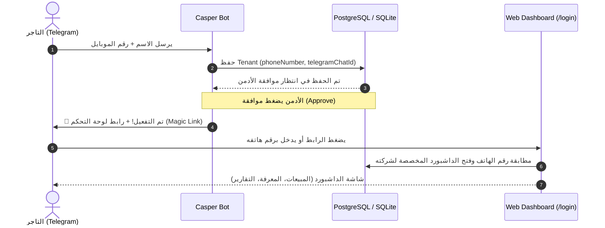

# 🌐 كيف يرتبط حساب التيليجرام بلوحة تحكم الويب؟ (Telegram to Web Bridge)

## 📊 Summary Table
| مرحلة الربط | ما يحدث في التيليجرام | ما يحدث على الويب (Web Dashboard) | وسيلة الربط |
| :--- | :--- | :--- | :--- |
| **1. التسجيل (Onboarding)** | العميل يسجل رقم هاتفه واسم شركته في البوت | يُنشأ له سجل في جدول `Tenant` مربوط بـ `phoneNumber` و `telegramChatId`. | **رقم الهاتف + Chat ID** |
| **2. الدخول المباشر (Magic Link)** | فور قبول الأدمن للطلب، يرسل البوت للعميل زر `[ 🌐 دخول لوحة التحكم ]`. | يضغط العميل على الزر فيفتح المتصفح ويسجل دخوله تلقائياً بدون الحاجة لكتابة كلمة سر. | **Signed Magic Token** |
| **3. الدخول اليدوي (Phone & PIN)** | - | يفتح صفحة `/login` ويكتب رقم هاتفه، فيتعرف السيستم على شركته ويطلب الـ PIN. | **رقم الهاتف المسجل** |

---

## 🚀 رحلة العميل من التيليجرام للويب

---

## 💡 التوصية لتعزيز التجربة
* إرسال زر **"🌐 فتح لوحة التحكم (لوجن مباشر)"** داخل رسالة التفعيل الترحيبية في التيليجرام بمجرد قبول الأدمن، بحيث يدخل بنقرة واحدة من هاتفه أو كمبيوتره.
